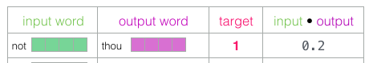

footer: univ.ai
autoscale: true

#[fit] Language and
#[fit] Other Temporal things
#[fit] Embeddings, etc


---

## Applications

- Sentiment analysis: s the review positive or negative?
- lamguage modeling: predict the next char/word/sentence
- Fact-checking. 
  - Input: sentence. Output: “Claim” or “Not Claim”. 
  - Input: Claim sentence. Output: “True” or “False”
- question answering, a particular form of sentence pair modeling.

---
[.footer: Images by [Jay Alammar](http://jalammar.github.io/illustrated-word2vec/)]
[.autoscale: false]

# The Basic Idea


- Observe a bunch of people
- **Infer** Personality traits from them
- Vector of traits is called an **Embedding**
- Who is more similar? Jay and who?
- Use Cosine Similarity of the vectors


---

## Categorical Data

*Example*: 

[Rossmann Kaggle Competition](https://www.kaggle.com/c/rossmann-store-sales). Rossmann is a 3000 store European Drug Store Chain. The idea is to predict sales 6 weeks in advance.

Consider `store_id` as an example. This is a **categorical** predictor, i.e. values come from a finite set. 

We usually **one-hot encode** this: a single store is a length 3000 bit-vector with one bit flipped on.

---

## What is the problem with this?

- The 3000 stores have commonalities, but the one-hot encoding does not represent this
- Indeed the dot-product (cosine similarity) of any-2 1-hot bitmaps must be 0
- Would be useful to learn a lower-dimensional **embedding** for the purpose of sales prediction.
- These store "personalities" could then be used in other models (different from the model used to learn the embedding) for sales prediction
- The embedding can be also used for other **tasks**, such as employee turnover prediction

---
[.footer: Image from  [Guo and Berkhahn](https://arxiv.org/abs/1604.06737)]

## Training an Embedding

- Normally you would do a linear or MLP regression with sales as the target, and both continuous and categorical features
- The game is to replace the 1-hot encoded categorical features by "lower-width" embedding features, for *each* categorical predictor
- This is equivalent to considering a neural network with the output of an additional **Embedding Layer** concatenated in
- The Embedding layer is simply a linear regression 


---

## Training an embedding (contd)

A 1-hot vector for a categorical variable $$v$$ with cardinality $$N(v)$$ can be written using the Kronecker Delta symbol as

$$ v_k = \delta_{jk}, j \in \{1..N(v)\} $$

Then an embedding of width (dimension) $$L$$ is just a $$ N(v) \times L$$ matrix of weights $$W_{ij}$$ such that multiplying the kth 1-hot vector by this weight matrix by picks out the kth row of weights (see right)

But how do we find these weights? We fit for them with the rest of the weights in the MLP!


---
[.code-highlight: all]
[.code-highlight: 6]
[.code-highlight: 12]
[.code-highlight: 13-17]
[.code-highlight: all]

```python
def build_keras_model():
    input_cat = []
    output_embeddings = []
    for k in cat_vars+nacols_cat: #categoricals plus NA booleans
        input_1d = Input(shape=(1,))
        output_1d = Embedding(input_cardinality[k], embedding_cardinality[k], name='{}_embedding'.format(k))(input_1d)
        output = Reshape(target_shape=(embedding_cardinality[k],))(output_1d)
        input_cat.append(input_1d)
        output_embeddings.append(output)

    main_input = Input(shape=(len(cont_vars),), name='main_input')
    output_model = Concatenate()([main_input, *output_embeddings])
    output_model = Dense(1000, kernel_initializer="uniform")(output_model)
    output_model = Activation('relu')(output_model)
    output_model = Dense(500, kernel_initializer="uniform")(output_model)
    output_model = Activation('relu')(output_model)
    output_model = Dense(1)(output_model)

    kmodel = KerasModel(
        inputs=[*input_cat, main_input], 
        outputs=output_model    
    )
    kmodel.compile(loss='mean_squared_error', optimizer='adam')
    return kmodel

def fitmodel(kmodel, Xtr, ytr, Xval, yval, epochs, bs):
    h = kmodel.fit(Xtr, ytr, validation_data=(Xval, yval),
                       epochs=epochs, batch_size=bs)
    return h
```

---

## Embedding is just a linear regression

So why are we giving it another name?

- it is usually to a lower dimensional space
- traditionally we have done linear dimensional reduction through PCA or SVD and truncation, but sparsity can throw a spanner into the works
- we train the weights of the embedding regression using SGD, along with the weights of the downstream task (here fitting the rating)
- the embedding can be used for alternate tasks, such as finding the similarity of users.

See how [Spotify](https://www.slideshare.net/AndySloane/machine-learning-spotify-madison-big-data-meetup) does all this..

---
[.footer: images in this section from [Illustrated word2vec](http://jalammar.github.io/illustrated-word2vec/)]

# Word Embeddings

- The Vocabulary $$V$$ of a corpus (large swath of text) can have 10,000 and maybe more words
- a 1-hot encoding is huge, moreover, similarities between words cannot be established
- we map words to a smaller dimensional latent space of size $$L$$ by considering some downstream task to train on
- we hope that the embeddings learnt are useful for other tasks.

---

## Obligatory example

See man->boy as woman->girl, similarities of king and queen, for eg. These are lower dimensional [GloVe embedding](https://nlp.stanford.edu/projects/glove/) vectors


---

## How do we train word embeddings?

We need to choose a downstream task. We could choose **Language Modeling**: predict the next word. We'll start with random "weights" for the embeddings and other parameters and run SGD. A trained model+embeddings would look like this:


---

How do we set up a training set?


Why not look both ways? This leads to the Skip-Gram and CBOW architectures..

---

## SKIP-GRAM: Predict Surrounding Words

Choose a window size (here 4) and construct a dataset by sliding a window across.

 

---

### Details

We assume that, Naive Bayes style, the joint probability of all **context** words $$\{w_o\}$$ in a window conditioned on the central word $$w_c$$ is the product of the individual conditional probabilities: 

$$P(\{w_o\} \mid w_c) = \prod_{i \in window}p(w_{oi} \mid w_c)$$

Now assume that each word $$w_i$$ is represented as 2 embeddings, an **input** embedding $$\boldsymbol{v}_i$$ when it is a central word and a context embedding $$\boldsymbol{u}_i$$ when it is in the surrounding window.


---

The probability of an output word, givem a central word, is assumed to be given by a softmax of the dot product of the embeddings. 

$$\mathbb{P}(w_o \mid w_c) = \frac{\text{exp}(\boldsymbol{u}_o^\top \boldsymbol{v}_c)}{ \sum_{i \in \mathcal{V}} \text{exp}(\boldsymbol{u}_i^\top \boldsymbol{v}_c)},$$ 

Then, assuming a text sequence of length $$T$$ and window size $$m$$ , the likelihood function is:

$${\mathcal L} = \prod_{t=1}^{T} \prod_{-m \leq j \leq m,\ j \neq 0} \mathbb{P}(w^{(t+j)} \mid w^{(t)}).$$

We'll use the Negative Log Likelihood as loss (NLL).

---


## Prediction


With random initial weights , we make a prediction for surrounding words, and calculate the NLL for the prediction. We then backpropagate the NLL's gradients to find new weights and repeat

Consider two sentences: "*I am running.*" and "*I am writing.*". "I" and "am" targets will backprop to same **input** embedding and so, after some training, "writing" and "running" will be highly correlated. Approppriate correlations try and emerge as corpus size increases.

---

## Problems

- in the forward mode, the calculation of softmax requires a sum over the entire vocabulary
- in the backward mode, the gradients need this sum too.

For large vocabularies, this is very expensive!

Changing from predicting neighbors to "*are we neighbors?*" changes model from neural net to logistic regression.

---

## Changing Tasks


But the response variable in the dataset changes to all 1's and a trivial classifier always returning 1 will give the best score. Not good. (this is equivalent to all embeddings being equal and infinite)

---

## Negative Sampling

 


To fix we randomly choose words from our vocabulary and label them with 0.


---

## Likelihood model

We go back to the old likelihood: $${\mathcal L} = \prod_{t=1}^{T} \prod_{-m \leq j \leq m,\ j \neq 0} \mathbb{P}(w^{(t+j)} \mid w^{(t)}).$$

But now, the probability is approximated using negative sampling as:

$$P(w^{(t+j)} \mid w^{(t)}) = P(D=1\mid w^{(t)}, w^{(t+j)})\prod_{k=1,\ w_k \sim P(w)}^K P(D=0\mid w^{(t)}, w_k).$$

The NLL now has a sum over a $$K$$-sized window, rather than the full vocabulary.


---

### Training the model


- The negative sampling probabilities are now sigmoids subtracted from 1, whereas the postives are simply sigmoids. 
- We now compute the loss, and repeat over training examples in our batch
- and backpropagate to obtain gradients and change the embeddings and weights some, for each batch, in each epoch


---

```python
def make_model(vector_dim, vocab_size, learn_rate):
    stddev = 1.0 / vector_dim
    initializer = RandomNormal(mean=0.0, stddev=stddev, seed=None)

    word_input = Input(shape=(1,), name="word_input")
    word = Embedding(input_dim=vocab_size, output_dim=vector_dim, input_length=1,
                    name="word_embedding", embeddings_initializer=initializer)(word_input)

    context_input = Input(shape=(1,), name="context_input")
    context = Embedding(input_dim=vocab_size, output_dim=vector_dim, input_length=1,
                    name="context_embedding", embeddings_initializer=initializer)(context_input)

    merged = dot([word, context], axes=2, normalize=False, name="dot")
    merged = Flatten()(merged)
    output = Dense(1, activation='sigmoid', name="output")(merged)

    optimizer = TFOptimizer(tf.train.AdagradOptimizer(learn_rate))
    model = Model(inputs=[word_input, context_input], outputs=output)
    model.compile(loss="binary_crossentropy", optimizer=optimizer)
        self.model = model

```

---

```python
def train(model, sequence, window_size, negative_samples, batch_size):
        """ Trains the word2vec model """

        # in order to balance out more negative samples than positive
        negative_weight = 1.0 / negative_samples
        class_weight = {1: 1.0, 0: negative_weight}
        sequence_length = len(sequence)
        approx_steps_per_epoch = (sequence_length * (
                window_size * 2.0) + sequence_length * negative_samples) / batch_size
        batch_iterator = skip_gram.batch_iterator(sequence, window_size, negative_samples, batch_size)

        model.fit_generator(batch_iterator,
                                 steps_per_epoch=approx_steps_per_epoch,
                                 epochs=epochs,
                                 verbose=verbose,
                                 class_weight=class_weight,
                                 max_queue_size=100)

```

---

### The result

- We discard the Context matrix, and save the embeddings matrix.
- We can use the Embeddings matrix for our next task (perhaps a sentiment classifier).
- We could have trained Embeddings along with that particular task to make the embeddings sentiment specific. There is always a tension between domain/task specific embeddings and generic ones
- This tension is usually resolved in favor of using generic embeddings since task specific datasets seem to be smaller
- We can still unfreeze pre-trained embedding layers to modify them for domain specific tasks via transfer learning.

---

## Usage of word2vec

- the pre-trained word2vec and other embeddings (such as GloVe) are used everywhere in NLP today
- the ideas have been used elsewhere as well. [AirBnB](http://delivery.acm.org/10.1145/3220000/3219885/p311-grbovic.pdf?ip=65.112.10.217&id=3219885&acc=OPENTOC&key=4D4702B0C3E38B35%2E4D4702B0C3E38B35%2E4D4702B0C3E38B35%2E054E54E275136550&__acm__=1554311026_27cfada2bffd4237ba58449ec09cf72b) and [Anghami](https://towardsdatascience.com/using-word2vec-for-music-recommendations-bb9649ac2484) model sequences of listings and songs using word2vec like techniques
- [Alibaba](http://delivery.acm.org/10.1145/3220000/3219869/p839-wang.pdf?ip=66.31.46.87&id=3219869&acc=OPENTOC&key=4D4702B0C3E38B35%2E4D4702B0C3E38B35%2E4D4702B0C3E38B35%2E054E54E275136550&__acm__=1553960802_303235e170b9c82dab21a176f6d72c6f) and [Facebook](https://ai.facebook.com/blog/open-sourcing-pytorch-biggraph-for-faster-embeddings-of-extremely-large-graphs) use word2vec and graph embeddings for recommendations and social network analysis.
- But word2vec cannot disambiguare the context of "bank" in "*open a bank account*" from that in "*on the river bank*"
- **ELMo** looks at the entire sentence before assigning a word an embedding. It is a Bi-Directional LSTM Model trained on language modeling and customized by training on specific tasks
- **BERT** trains a transformer based model on language modeling via masking future words and via predicting futire and past sentences. This provides SOTA results on many downstream tasks by either fine-tuning it or using pre-trained embeddings.